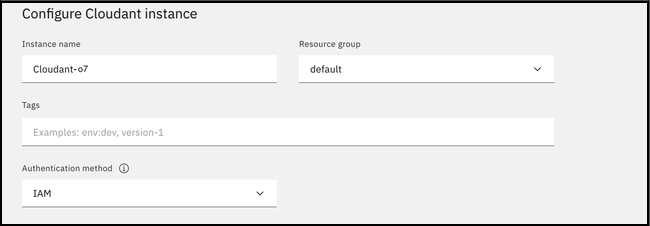

---

copyright:
  years: 2015, 2021
lastupdated: "2021-10-05"

keywords: example, connect to service instance, create service instance, service credentials, instance

subcollection: Cloudant

content-type: tutorial
services: Cloudant
account-plan: lite 
completion-time: 20m

---

{:new_window: target="_blank"}
{:shortdesc: .shortdesc}
{:codeblock: .codeblock}
{:pre: .pre}
{:screen: .screen}
{:tip: .tip}
{:note: .note}
{:important: .important}
{:deprecated: .deprecated}
{:external: target="_blank" .external}
{:step: data-tutorial-type='step'}

<!-- Acrolinx: 2021-04-09 -->

# Getting started with {{site.data.keyword.cloudant_short_notm}}
{: #getting-started-with-cloudant}
{: toc-content-type="tutorial"}
{: toc-services="Cloudant"}
{: toc-completion-time="20m"}

The {{site.data.keyword.cloudantfull}} *Getting started* tutorial demonstrates how to use the {{site.data.keyword.cloud}} dashboard to create an {{site.data.keyword.cloudant_short_notm}} service instance. You also see essential information to enable your application to work with the database. 
{: shortdesc} 

## Objectives
{: #objectives-get-started}

- Create a service instance. 
- Create an {{site.data.keyword.cloudant_short_notm}} service credential. 

## Creating a service instance
{: #creating-an-ibm-cloudant-instance-on-ibm-cloud}
{: step}

1.  Log in to your {{site.data.keyword.cloud_notm}} account, and click `Create resource`.  

    {: caption="Figure 1. {{site.data.keyword.cloud_notm}} dashboard" caption-side="bottom"}

    The {{site.data.keyword.cloud_notm}} dashboard can be found at:
    [https://cloud.ibm.com/](https://cloud.ibm.com/){: new_window}{: external}.
    After you authenticate with your user name and password,
    you're presented with the {{site.data.keyword.cloud_notm}} dashboard. 
    {: note}
    
2.  Type `Cloudant` in the Search bar and click to open it:

    {: caption="Figure 2. {{site.data.keyword.cloud_notm}} database services" caption-side="bottom"}

3.  Select an offering and an environment.  

    {: caption="Figure 3. {{site.data.keyword.cloudant_short_notm}} offering and environment" caption-side="bottom"}

4.  Type an instance name.  

    {: caption="Figure 4. {{site.data.keyword.cloudant_short_notm}} service name and credentials" caption-side="bottom"}

    (In this example, the instance name is `Cloudant-o7`.) Verify that the resource group and authentication methods are correct. Add a tag if you like. The authentication methods that are available include `IAM` or `IAM and legacy credentials`. For more information, see [authentication methods](/docs/Cloudant?topic=Cloudant-managing-access-for-cloudant){: new_window}.

    The {{site.data.keyword.cloudant_short_notm}} team recommends that you use IAM access controls over {{site.data.keyword.cloudant_short_notm}} legacy authentication whenever possible.
    {: important}
 
5.  Select your plan.  
    See the capacity in the table that follows.   

    {: caption="Figure 5. Plans and capacity" caption-side="bottom"}

6.  To create the service, click `Create`:

    After you click `Create`, the system displays a message to say that the instance is being provisioned, which returns you to the Resource list. From the Resource list, you see that the status for your instance is, `Provision in progress`. 

7.  When the status changes to `Active`, click the instance, and proceed to the next section, [Creating service credentials](#creating-service-credentials).   

## Creating service credentials
{: #creating-service-credentials}
{: step}

1.  To create the connection information that your application needs to connect to the instance, click `New credential`.

    {: caption="Figure 6. Service credentials" caption-side="bottom"}

2.  Enter a name for the new credential in the Add new credential window. 

3.  Accept the Manager role.

4.  (Optional) Create a service ID or have one automatically generated for you. 

5.  (Optional) Add inline configuration parameters. This parameter isn't used by {{site.data.keyword.cloudant_short_notm}} service credentials, so ignore it. 

6.  Click `Add`. 

    {: caption="Figure 7. Service credentials" caption-side="bottom"}

7.  To see the credentials that are required to access the service, click the chevron. 

    {: caption="Figure 8. Viewing the {{site.data.keyword.cloudant_short_notm}} service credentials" caption-side="bottom"}

    The details for the service credentials open like the following example:

    {: caption="Figure 9. {{site.data.keyword.cloudant_short_notm}} service credentials" caption-side="bottom"}

The service credentials in this example were defined when a demonstration {{site.data.keyword.cloudant_short_notm}} service was created on {{site.data.keyword.cloudant_short_notm}}. The credentials are reproduced here to show how they would appear in the dashboard. However, the demonstration {{site.data.keyword.cloudant_short_notm}} service was removed, so these credentials are no longer valid. You *must* supply and use your own service credentials.
{: note}

For more information about the fields in your credentials, see [Understanding your service credentials](/docs/Cloudant?topic=Cloudant-locating-your-service-credentials#the-service-credentials).

