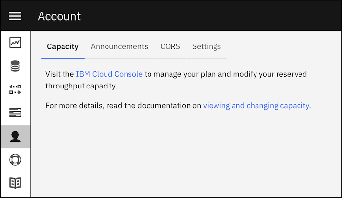

---

copyright:
  years: 2015, 2018
lastupdated: "2018-09-27"

---

{:new_window: target="_blank"}
{:shortdesc: .shortdesc}
{:screen: .screen}
{:codeblock: .codeblock}
{:pre: .pre}
{:tip: .tip}

<!-- Acrolinx: 2017-05-10 -->

# Pricing
{: #pricing}

{{site.data.keyword.cloudantfull}} allows tuning to scale up and down your provisioned throughput 
capacity, which is a reserved number of lookups, writes, and queries each second allocated to 
an instance. The throughput capacity level is the maximum usage level. If you attempt to 
exceed the reserved capacity, you get an HTTP 429 status code that indicates the 
application is trying to exceed its provisioned throughput capacity allowance.

## Pricing Examples 
{: #pricing-examples}

Let's assume you are building a mobile app with {{site.data.keyword.cloudant_short_notm}} and do not yet know the capacity 
that you might need. In this case, we recommend that you start with the lowest provisioned throughput 
capacity and increase it as needed by your application's usage over time. {{site.data.keyword.cloudant_short_notm}} bills 
pro-rated hourly and changing the provisioned throughput capacity does not incur downtime. 

For the mobile app example, you start with the minimum provisioned throughput capacity for 
the Standard plan that is 100 lookups/sec, 50 writes/sec, and 5 queries/sec. The cost for 
this capacity is $0.105 per hour. The 100 lookups/sec, 50 writes/sec, and 5 queries/sec are 
a block of provisioned throughput capacity. When you need to scale up (or down), you 
can scale in increments of these blocks of capacity. Assuming the instance has less than 
the 20 GB of storage that is included in the Standard plan, no storage costs are incurred. On the 
{{site.data.keyword.cloudant_short_notm}} Dashboard's > Account > Capacity tab, the 
provisioned throughput capacity setting looks like this screen capture:

The capacity slider shows the hourly cost of the provisioned throughput capacity of 100 lookups/sec, 50 writes/sec, and 5 queries/sec in USD of $0.105/hour. The slider shows a rough cost per month of $76.65. The monthly amount is an estimate based on an average of 730 hours per month. The cost in any month can be slightly different depending on the number of hours in the month.

Example equation: 

- $0.105 per hour 1 block of 100 lookups/sec, 50 writes/sec, and 5 queries/sec provisioned throughput capacity * 730 hours (approximate hours in a month)
- Total = $76.65

Lookups, writes, and queries cannot be scaled independently. Use the slider to select the number of blocks of provisioned throughput capacity based on the maximum limit of either lookups/sec, writes/sec, or queries/sec required for your application. For example, if your application requires 1,000 lookups per second, use the slider to select the capacity that offers 1,000 lookups/sec, 500 writes/sec, and 50 queries/sec, even if you do not need the corresponding number of writes or queries.

How do you estimate the total cost for provisioned throughput capacity per month of 1,000 lookups, 500 writes, and 50 queries? 

- $0.105 per hour 10 blocks of 100 lookups/sec, 50 writes/sec, and 5 queries/sec provisioned throughput capacity * 730 hours (approximate hours in a month)
- Alternatively the slider shows you the provisioned throughput capacity of 1000 lookups/sec, 500 writes/sec, and 50 queries/sec costs $1.050/hour * 730 hours
- Total = $766.50

## Data Usage 
{: #data-usage}

What about pricing for data overage, how does that work?

Plan | Storage included | Overage limit
-----|------------------|--------------
Lite | 1 GB |  Your account is blocked from writing new data until you delete enough data to be under the 1 GB limit, or upgrade to a higher plan.
Standard | 20 GB | Additional storage costs $0.0014 per GB per hour, which is approximately $1/GB per month.

How does data display in the {{site.data.keyword.cloud_notm}} Usage Dashboard?

This view shows the totals for usage that are accrued during this month, and so, shows only costs for the month so far. The Estimated Total reflects the bill so far for the month. By the end of the month, you see your average capacity for the month, which is your total monthly bill. The `STORAGE_MANAGED_PER_MONTH` field shows only the amount higher than the 20 GB included, so in the following example, you see approximately 40 GB of data total in the account.  

When you use less than 20 GB of storage, the display shows 0 GB since you did not go over the limit.
