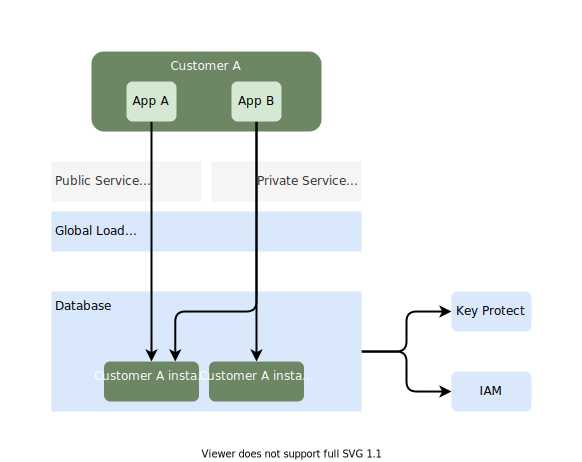

---

copyright:
  years: 2020, 2023
lastupdated: "2023-04-20"

keywords: public isolation, compute isolation, cloudant architecture, workload isolation, byok

---

{{site.data.keyword.attribute-definition-list}}

# Learning about {{site.data.keyword.cloudant_short_notm}} architecture and workload isolation
{: #compute-isolation}

Review the following sample architecture for {{site.data.keyword.cloudantfull}}, and learn more about different isolation levels. After that, you can choose the solution that best meets the requirements of the workloads that you want to run in the cloud. 
{: shortdesc}

## {{site.data.keyword.cloudant_short_notm}} isolation models and architecture
{: #isolation-models-architecture}

{{site.data.keyword.cloudant_short_notm}} is a multi-tenant-capable database system with mechanisms in place to distribute any shared resources like CPU or I/O fairly among the active tenants. {{site.data.keyword.cloudant_short_notm}} implements isolation in the database layer itself, and not by relying on containers. Instances are isolated from each other for access control, meaning that it is not possible to read or write data in one instance from another. 

Workload isolation is an important consideration for many customers. To select the best {{site.data.keyword.cloudant_short_notm}} plan choice for your workload isolation requirements, see the following architectural information: 

1.  Standard and Lite plans on Multi-Tenant Hardware, which offer excellent isolation.

2.  Standard plan provisioned on a Dedicated Hardware plan instance, which offers improved isolation over Standard on Multi-Tenant Hardware. 

### Standard and Lite
{: #standard-and-lite}

Standard and Lite plans are provisioned onto large, shared {{site.data.keyword.cloudant_short_notm}} database deployments where customers share compute and storage resource. Standard and Lite plans apply provisioned throughput rate-limiting, along with other resource and access isolation mechanisms within the database layer itself. Together, these provide strong security guarantees alongside robust resource separation within the shared environment.

{: caption="Figure 1. Data isolation on {{site.data.keyword.cloudant_short_notm}} Standard plan" caption-side="bottom"} 

Disk encryption is used to provide encryption at rest by using an {{site.data.keyword.IBM_notm}} owned and managed encryption key. Customer data resides in different files on disk. 

### Standard on Dedicated Hardware
{: #standard-on-dedicated-hardware}

A Dedicated Hardware instance offers improved storage and compute isolation for your most valuable data, including use of BYOK. After a Dedicated Hardware instance is provisioned, you can provision many Standard plan instances onto this Dedicated Hardware instance to store your data. While these Standard plan instances share the Dedicated Hardware's compute and storage, the instances do not share Dedicated Hardware's compute and storage with other customers.  
  
{: caption="Figure 2. Data isolation on {{site.data.keyword.cloudant_short_notm}} Dedicated Hardware plan" caption-side="bottom"} 

Disk encryption is used to provide encryption at rest. In the Dedicated Hardware plan, customers can use their own keys by using {{site.data.keyword.cloud}} Key Protect's BYOK to further secure their data. 

Dedicated Hardware instances provide IP allowlisting and private network utilization to secure network access.

Data and resource isolation between the Standard plan instances on a Dedicated Hardware instance is provided by using the same robust mechanisms that are used within the multi-tenant deployment option. 
