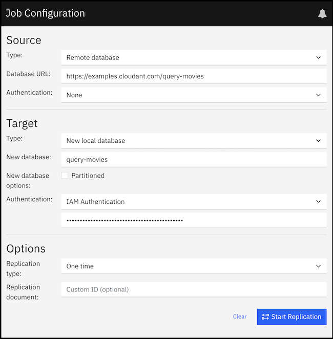
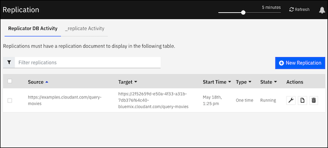
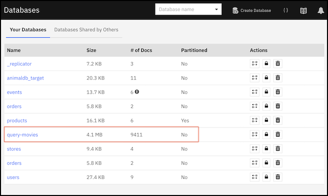

---

copyright:
  years: 2020
lastupdated: "2020-09-09"

keywords: create index, create query, run query, fields, operators, monitor instance

subcollection: Cloudant

---

{:new_window: target="_blank"}
{:shortdesc: .shortdesc}
{:screen: .screen}
{:codeblock: .codeblock}
{:pre: .pre}
{:tip: .tip}
{:note: .note}
{:important: .important}
{:deprecated: .deprecated}
{:external: target="_blank" .external}

<!-- Acrolinx: 2020-04-23 -->

# Using the {{site.data.keyword.cloudant_short_notm}} Dashboard
{: #using-the-ibm-cloudant-dashboard}

This tutorial demonstrates different functions available in the {{site.data.keyword.cloudantfull}} dashboard. For example, you learn how to create a database, populate it
with documents, replicate a database, sort active tasks, review your account, and view support ticket.
{: shortdesc}

## Before you begin
{: ##before-you-begin-dt}

Before you begin, follow these steps to prepare for the tutorial:

1.  Log in to your {{site.data.keyword.cloud}} account.

    The {{site.data.keyword.cloud_notm}} dashboard can be found at:
    [https://cloud.ibm.com/](https://cloud.ibm.com/){: new_window}{: external}.
    After you authenticate with your user name and password,
    you're presented with the {{site.data.keyword.cloud_notm}} dashboard. Click the `Create resource` button.

    {: caption="Figure 1. {{site.data.keyword.cloud_notm}} dashboard" caption-side="bottom"}
    
2. Create a service instance on {{site.data.keyword.cloud_notm}} by following the [Creating an {{site.data.keyword.cloudant_short_notm}} instance on {{site.data.keyword.cloud_notm}}](/docs/Cloudant?topic=Cloudant-creating-an-ibm-cloudant-instance-on-ibm-cloud) tutorial.

Now, we can review the available features in {{site.data.keyword.cloudant_short_notm}}, and create queries against the database you create.  

## Creating a database
{: #creating-a-database-dt}

In this exercise, you create the `dashboard-demo` [database](/docs/Cloudant?topic=Cloudant-databases#create-database), which 
is the database that we use in this tutorial.

1. From the {{site.data.keyword.cloudant_short_notm}} dashboard, click **Create Database**.

   The Create database window opens. 

2. Enter the Database name `dashboard-demo`.

3. Select **Non-partitioned**, and click **Create**.

   The `dashboard-demo` database opens automatically.

  Now, we can create some documents. 

## Adding documents to the database
{: #creating-documents-in-the-database-dt}

The [documents](/docs/Cloudant?topic=Cloudant-documents#documents)
that you create in this exercise include the data that you use to query the `dashboard-demo` database in later exercises.

1.  Click **Create Document**. 

    The New Document window opens.

2.  Copy the following sample text and replace the existing text in the new document.

  *This example is the first sample document*:
  ```json
  {
    "firstname": "Sally",
    "lastname": "Brown",
    "age": 16,
    "location": "New York City, NY",
    "_id": "doc1"
  }
  ```
  {: codeblock}

3.  Repeat steps 1 and 2 to add the remaining documents to the database.

  *This example is the second sample document*:
  ```json
  {
    "firstname": "John",
    "lastname": "Brown",
    "age": 21,
    "location": "New York City, NY",
    "_id": "doc2"
  }
  ```
  {: codeblock}

  *This example is the third sample document*:
  ```json
  {
    "firstname": "Greg",
    "lastname": "Greene",
    "age": 35,
    "location": "San Diego, CA",
    "_id": "doc3"
  }
  ```
  {: codeblock}

  *This example is the fourth sample document*:
  ```json
  {
    "firstname": "Anna",
    "lastname": "Greene",
    "age": 44,
    "location": "Baton Rouge, LA",
    "_id": "doc4"
  }
  ```
  {: codeblock}

  *This example is the fifth sample document*:
  ```json
  {
    "firstname": "Lois",
    "lastname": "Brown",
    "age": 33,
    "location": "New York City, NY",
    "_id": "doc5"
  }
  ```
  {: codeblock}

  You populated the `dashboard-demo` with five records. You can see the records from the Table view in the following screen capture:

   {: caption="Figure 2. Sample documents" caption-side="bottom"} 

### Running a simple query
{: #running-a-simple-query-dt}

This example demonstrates how {{site.data.keyword.cloudant_short_notm}} Query finds documents based on the `lastname` and the `firstname`.   

1.  Click the **Query** tab.
2.  Copy and paste the following sample JSON into the {{site.data.keyword.cloudant_short_notm}} Query window:
  ```json
   {
      "selector": {
            "lastname" : "Greene",
            "firstname" : "Anna"            
         }        
   }
  ```
  {: codeblock}

3.  Click **`Run Query`**.

    The query results display. You can see them from the Table view in the following screen capture:

    {: caption="Figure 3. Results from the query" caption-side="bottom"}

For more information on queries, see [{{site.data.keyword.cloudant_short_notm}} Query](/docs/Cloudant?topic=Cloudant-creating-an-ibm-cloudant-query) tutorial or the API reference about [{{site.data.keyword.cloudant_short_notm}} Query](/docs/Cloudant?topic=Cloudant-query#query).

## Replicating a database
{: #replicate-database-dt}

When you replicate a database, it synchronizes the state of two databases: source and target. A replication copies all the changes that happened in the source database to the target database. If a document is deleted from the source database, it's also deleted from the target database.

For more information, see [Replication](/docs/Cloudant?topic=Cloudant-replication-api#replication-operation) in the API reference.

To create a replication job, follow these steps:

1. Click the **Replication** tab.

2. Click **New Replication**. 

   The Job configuration page opens.  

   {: caption="Figure 4. Job configuration page" caption-side="bottom"} 
   
   Additionally, you can create a replication from the Databases page by clicking the **Replicate** button in the Actions column.
   {: note} 

3. Enter the following information for your replication job:

   Source:
      - Type - Select **Remote database**.
      - Name - Enter the Database URL:
        ```http
        https://examples.cloudant.com/query-movies
        ``` 
        {: codeblock}

      - Authentication - Leave as `None`.

   Target: 
      - Type - Select **New local database**.
      - New database - Enter the name for the new database, **`query-movies`**. 
      - New database options - Leave Partitioned unchecked.
      - Authentication - Select **IAM Authentication**. 
      - IAM API Key - Enter the `apikey` from the Service credentials for your instance.
        
        For more information, see the section on [Locating your service credentials](/docs/Cloudant?topic=Cloudant-creating-an-ibm-cloudant-instance-on-ibm-cloud#locating-your-service-credentials).

   Options:
     - Replication type - Leave as `One time`. 
     - Replication document - Leave as `Custom ID (optional)`. 

    {: caption="Figure 5. Replication configuration page" caption-side="bottom"}

4. Click **Start Replication**. 

   The Replication page opens where you can see that your replication job is running. 

   {: caption="Figure 6. Status of your replication job" caption-side="bottom"} 

5. See the Completed status when your job finishes. 

   {: caption="Figure 7. Completed job status" caption-side="bottom"} 

6. Check that the database was created on the Databases page. 

   {: caption="Figure 8. Databases page" caption-side="bottom"} 

## Monitoring active tasks
{: #monitoring-active-tasks-dt}

The Active tasks page displays a list of all running tasks. When you monitor your system's performance, this list can help you find potential issues. You can see a list of active tasks, which includes compaction, replication, and indexing. For more information, see the [Managing tasks](/docs/Cloudant?topic=Cloudant-managing-tasks) guide. 

1. Click **Active Tasks** in the left menu. 

   The Active Tasks page opens. 

   {: caption="Figure 9. Monitor active tasks" caption-side="bottom"} 

2. Navigate to task-specific information by clicking the associated tab. 

## Monitoring with {{site.data.keyword.cloudant_short_notm}}
{: #monitoring-with-cloudant-dt}

Monitor your usage with a graph that shows your throughput by reads, writes, and global queries. You can see your current operations, denied requests, and storage usage. 

1. Click the **Monitoring** tab in the left navigation. 

   The Monitoring page opens to the Current Operations tab. 
   Review recent consumption of provisioned throughput capacity by looking at requests broken down by reads, writes, and global queries. The dotted line is the peak capacity that is allowed for your instance. Peak capacity is based on what is set for your provisioned throughput capacity.

   {: caption="Figure 10. Current Operations tab" caption-side="bottom"}

2. Click the **Denied Requests** tab. 

   Review the number of denied requests from a given second that are shown by the number of "429: too many requests." responses. Requests are denied when they exceed the provisioned throughput capacity set for the instance. The graph shows the denied requests broken down by reads, writes, and global queries.

   {: caption="Figure 11. Denied Requests tab" caption-side="bottom"}

3. Click the **Storage** tab.

   Periodically review your storage, so you are prepared if your plan's provisioning needs to be changed. 

   {: caption="Figure 12. Storage tab" caption-side="bottom"}

For more information, see [Plans and provisioning](/docs/Cloudant?topic=Cloudant-ibm-cloud-public).


 


