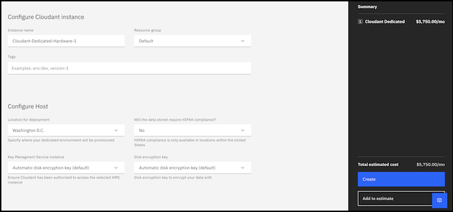

---

copyright:
  years: 2015, 2017
lastupdated: "2017-10-31"

---

{:new_window: target="_blank"}
{:shortdesc: .shortdesc}
{:screen: .screen}
{:codeblock: .codeblock}
{:pre: .pre}

<!-- Acrolinx: 2017-02-23 -->

# Creating and leveraging a {{site.data.keyword.cloudantfull}} Dedicated Hardware plan instance on Bluemix

This tutorial shows you how to create a {{site.data.keyword.cloudant_short_notm}} Dedicated Hardware plan instance 
using the IBM Cloud dashboard, and shows you how to subsequently provision one or 
more Standard plan instances to run on it. 

Creating a {{site.data.keyword.cloudant_short_notm}} Dedicated Hardware plan instance results in the provisioning 
of a {{site.data.keyword.cloudant_short_notm}} environment on dedicated hardware for your sole use. A service 
instance is created in the IBM Cloud dashboard, but note that you cannot 
access the Dedicated Hardware plan instance directly and will not have 
any Service Credentials for it. You can use a {{site.data.keyword.cloudant_short_notm}} Dedicated Hardware 
plan instance after it is created by provisioning one or more Standard plan 
instances on it.

## Creating a {{site.data.keyword.cloudant_short_notm}} Dedicated Hardware plan instance

1.  Log in to your {{site.data.keyword.Bluemix_notm}} account. 
    The {{site.data.keyword.Bluemix_notm}} dashboard can be found at:
    [http://bluemix.net ](http://bluemix.net){:new_window}.
    After authenticating with your user name and password,
    you are presented with the {{site.data.keyword.Bluemix_notm}} dashboard: 
    

2.  Click the `Catalog` link: 
     
    A list of the services available on {{site.data.keyword.Bluemix_notm}} appears.

3.  Click the `Data & Analytics` entry under the `Services` heading: 
     
    A list of the Data & Analytics services
    available on {{site.data.keyword.Bluemix_notm}} appears.

4.  Click the {{site.data.keyword.cloudant_short_notm}} service: 
     
    The page for creating a service appears. 

5.  Select the `Dedicated Hardware` hardware plan from the list of pricing plans at the bottom of the page: 
    
    
6.  Fill out the following parameters at the top of the page:  
    -   Enter a Service name. 
    -   Specify the region and space to deploy. 
    -   Select a location for deployment. 
    -   Answer yes or no to the question about whether HIPAA is required. Note that HIPAA is only valid for U.S. locations.  
     
    **Note**: You deploy and provision Standard plan instances in the same region and space.    
     
    Start the provisioning process. 
    
7.  Click the `Create` button to begin provisioning from the bottom of the page.  
    **Note**: Billing is prorated daily so make sure that you want to provision and 
    pay for an environment before clicking the **Create** button. 
     
    A request is sent to provision a Dedicated Hardware plan instance on bare 
    metal servers. Provisioning time is asynchronous and can take up to 5 days. 
    During provisioning, a spinning wheel appears next to the instance in 
    your IBM Cloud dashboard. 

## Provisioning a Standard plan instance on a Dedicated Hardware environment

1.  Log in to your {{site.data.keyword.Bluemix_notm}} account. 
    The {{site.data.keyword.Bluemix_notm}} dashboard can be found at:
    [http://bluemix.net ](http://bluemix.net){:new_window}.
    After authenticating with your user name and password,
    you are presented with the {{site.data.keyword.Bluemix_notm}} dashboard: 
    

2.  Click the `Catalog` link: 
     
    A list of the services available on {{site.data.keyword.Bluemix_notm}} appears.

3.  Click the `Data & Analytics` entry under the `Services` heading: 
     
    A list of the Data & Analytics services
    available on {{site.data.keyword.Bluemix_notm}} appears.

4.  Click the {{site.data.keyword.cloudant_short_notm}} service: 
     
    The page for creating a service appears.  

5.  Click `Standard` from the pricing plans at the bottom of the page.  
    **Note**: You cannot provision a Lite plan instance on a Dedicated Hardware environment. 
    
    
6.  Fill out the parameters at the top of the page by entering a Service name, Credential name, and so on 
    as you would for a Standard plan instance. Decide whether to provision on the default regional multi-tenant 
    environment or the Dedicated Hardware environment you have provisioned by using the `Select Environment` drop-down. 
    
    
7.  Click the `Create` button at the bottom of the page. 
    After a few seconds, the instance is provisioned on the environment you selected. 
    
    
8.  Obtain your Service Credentials and access the Cloudant Dashboard as you do for a multi-tenant Cloudant instance. 
    See more information about how to locate your Service Credentials [here ](https://console.bluemix.net/docs/services/Cloudant/tutorials/create_service.html#locating-your-service-credentials){:new_window}. 
     