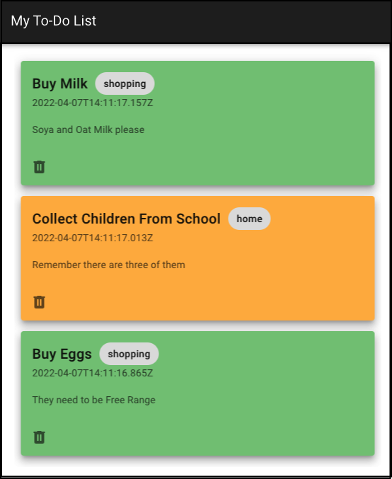

---

copyright:
  years: 2020, 2022
lastupdated: "2022-06-01"

keywords: todo list tutorial

subcollection: Cloudant

content-type: tutorial
services: Cloudant
account-plan: lite
completion-time: 1hr

---

{{site.data.keyword.attribute-definition-list}}

# Creating a web-based To-Do list
{: #web-based-todo-list}
{: toc-content-type="tutorial"}
{: toc-services="Cloudant"}
{: toc-completion-time="1hr"}

Create a simple web-based to do list to get familiar with the basic {{site.data.keyword.cloud_notm}} features.
{: shortdesc}

## Objectives
{: #objectives-web-based-todo-list}

1. From this tutorial, you learn how to create a basic website that interfaces with your {{site.data.keyword.cloud_notm}} database to read and write data.

   The project is a simple to do list, where you can see a list of notes. You can add and delete notes. Each of your notes has a tag, and you can filter your notes by tag.
   {: tip}

1. In order to create this to do list, your application needs to be able to read and write to the database. To read to dos in "newest first" order and to filter by tag, your database needs to have some secondary indexes. So let's create all of that.

You can complete the tutorial in less than an hour. It doesn't cost you anything over your current {{site.data.keyword.cloudant_short_notm}} bill (so it's free if you are on the {{site.data.keyword.cloudant_short_notm}} Lite plan).

The website that you create is served from your local machine, so no other services are required apart from {{site.data.keyword.cloud_notm}}.

Once you complete it, you have a basic understanding of how applications can interface with {{site.data.keyword.cloudant_short_notm}} through an {{site.data.keyword.cloudant_short_notm}} SDK (in this case, NodeJS).

## Prerequisites
{: #prereq-web-based-todo-list}

You need the following implements to do this tutorial:

- An {{site.data.keyword.cloudant_short_notm}} service instance and some service credentials. You can create the instance and credentials in the {{site.data.keyword.cloudant_short_notm}} dashboard by following the [Getting started with {{site.data.keyword.cloudant_short_notm}}](/docs/Cloudant?topic=Cloudant-getting-started-with-cloudant) tutorial. Be sure to make a note of the APIKey and URL when you create your service credentials.
- Access to a Mac or Linux&trade; terminal
- [Git](https://git-scm.com/downloads)
- [Node.js and npm](https://docs.npmjs.com/downloading-and-installing-node-js-and-npm)


## Get the code
{: #get-the-code}
{: step}

1. Open your terminal.
2. Type the following command:

   ```sh
   git clone https://github.com/IBM-Cloud/todo-list.git
   cd todo-list
   ```
   {: codeblock}

## Prepare the environment and run the website
{: #prepare-environment}
{: step}

In this step, you install all the code dependencies and environment variables you need to run your website.

1. Ensure you are in the `todo-list` directory.
1. From your terminal, run the following command:

   ```sh
   npm install
   export CLOUDANT_APIKEY="<the_apikey_from_prerequisites>"
   export CLOUDANT_URL="https://<the_url_from_prerequisites>"
   npm run start
   ```
   {: codeblock}

When you run this command for the first time, your code detects that no database exists. The code creates a database for you with some indexes (by date and by tag) as well as some sample data.
{: tip}

## Visit your website!
{: #visit-website}
{: step}

Now, you can check out your website.

1. From your browser, navigate to `http://localhost:8080`.

   You can see your to do list with a couple of items on it:

   {: caption="Your web-based to do list" caption-side="bottom"}

1. Add or delete notes, or you can filter by tag by clicking one of the tags.

## Understanding the code
{: #understand-code}

### Database and Index creation
{: #database-index-creation}

The backend script (`server.js`), on start-up, tries to connect to the `todo` database by using the `getDatabaseInformation` method. If it doesn't find it, it attempts to create it by using the `putDatabase` method.

After you create the `todo` database, it creates two indexes by using the `postIndex` method. The first creates an index on the timestamp field (the creation date of your note), so it can retrieve all notes in reverse chronological order. The second index is on the tag and timestamp so that it can filter by tag and return a date-ordered list for a known tag.

### Using the database
{: #using-the-database-todo}

The front end is using the popular [express](https://expressjs.com/) framework to display a webpage and call service endpoints in your backend when you click different actions, like create, delete, and filter.

For example, when your webpage is first loaded, it calls the `GET /todolist` endpoint, which uses the `postFind` method to query the database for all documents (by using the index previously mentioned), order them by timestamp, and return them to the front end for display.

Filtering by tag uses the same `postFind` method, but by using the second index, you create and delete notes by usings the `postDocument` and `deleteDocument` methods.

## Summary
{: #summary-todo}

{{site.data.keyword.cloudant_short_notm}} allows rapid development of web applications, as its HTTP API is modeled by the [Node.js SDK](https://www.npmjs.com/package/@ibm-cloud/cloudant) and is easy to integrate with your own code. You create an {{site.data.keyword.cloudant_short_notm}} database and add JSON documents that model your own data. Remember to create secondary indexes to help service your query access patterns so that query performance remains quick as your data volume grows.

If you don't fancy writing JavaScript, we have SDKs for [Java&trade;, Python, and Go](/apidocs/cloudant) too, as well as our [HTTP API](/apidocs/cloudant). Don't forget. The [{{site.data.keyword.cloudant_short_notm}} Dashboard](/docs/Cloudant?topic=Cloudant-connecting#ibm-cloudant-dashboard) is a great way to explore your databases, create and modify documents, and refine your index and querying skills.

Further best practice guidance can be found in our [blog](https://blog.cloudant.com/2019/11/21/Best-and-Worst-Practices.html) and [documentation](/docs/services/Cloudant/getting-started.html). For a video guide to {{site.data.keyword.cloudant_short_notm}} and its capabilities, see the course in our [learning center](/docs/Cloudant?topic=Cloudant-learning-center).
